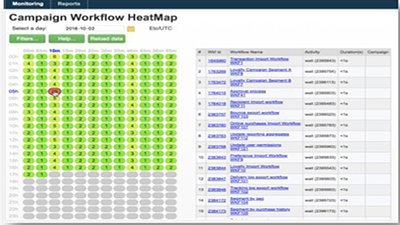
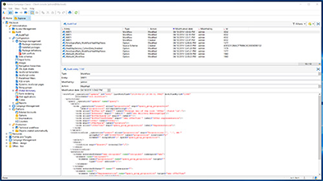
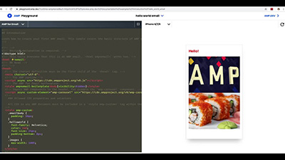

# Adobe Campaign Classic-Tutorials – Übersicht

Adobe Campaign bietet eine Plattform zur Konzeption kanalübergreifender Kundenerlebnisse und stellt dazu eine Umgebung für die Entwicklung visueller Kampagnen, die Verwaltung von Echtzeit-Interaktionen und die kanalübergreifende Umsetzung bereit. Dieses Benutzerhandbuch enthält Videos und Tutorials zu den verschiedenen Funktionen und Leistungsmerkmalen von Adobe Campaign Classic.

## Neue Funktionen

* **[E-Mail-Versand erstellen und entwerfen](/help/sending-messages/email-channel/create-and-design-email-deliveries.md)**

   *Machen Sie sich mit dem Erstellen eines E-Mail-Versands vertraut und lernen Sie, wie E-Mail-Inhalte entworfen und personalisiert werden.*

* **[Erste Schritte mit Push-Benachrichtigungen für Android](/help/tutorial-getting-started-with-push-notifications-for-android/introduction.md)**

   *Dieses Tutorial führt Sie durch die Schritte, die zum Senden von Push-Benachrichtigungen von Adobe Campaign an eine Android-App erforderlich sind.*

* **[Zuweisen von Subdomains mit CNAME (Beta)](/help/control-panel-tutorials/subdomains-and-certificates/delegating-subdomains-using-cname.md)**

   *Erfahren Sie, wie Sie eine Subdomain mit CNAME im Control Panel einrichten und senden.*

## Mitarbeiterauswahl

<table>
<tr>
  <td>
    
    

      <a href="./monitoring-campaign-classic/workflow-heatmap.md">
    <strong>Workflow-Heatmaps</strong>
    </a>
    

    

    <em>Verschaffen Sie sich einen Überblick über die Zahl gleichzeitiger Workflows.</em>
    

  </td>
   <td>
    
    

      <a href="./monitoring-campaign-classic/audit-trail.md">
    <strong>Audit-Protokoll</strong>
    </a>
    
 
    

    <em>Erfassen Sie eine umfassende Liste von Aktionen und Ereignissen, die in Adobe Campaign auftreten.</em>
    

  </td>
  <td>
    
    

      <a href="./sending-messages/email-channel/defining-interactive-email-content-with-amp.md">
    <strong>Definieren interaktiver E-Mail-Inhalte mit AMP</strong>
    </a>
    

    

    <em>Erfahren Sie, wie Sie AMP in Adobe Campaign Classic aktivieren und verwenden.</em>
    

  </td>
</tr>
</table>

## Zusätzliche Ressourcen

* [Dokumentation](https://docs.adobe.com/content/help/de-DE/campaign-classic/using/getting-started/starting-with-adobe-campaign/about-adobe-campaign-classic.html)
